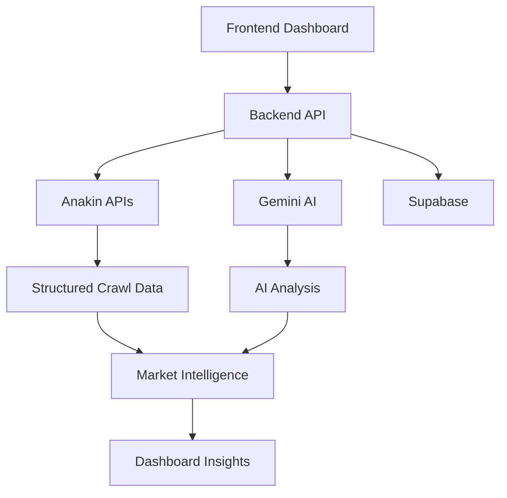

# SignalX AI

> Autonomous Startup Intelligence Engine powered by AI + Anakin APIs


## 🌐 Live Demo

https://signal-x-hackathon.vercel.app/

---

## ✨ Overview

SignalX AI is an AI-powered startup intelligence platform that autonomously crawls websites, extracts structured business data, analyzes competitors, identifies market gaps, and generates actionable startup insights.

Built using:
- Anakin APIs
- Gemini AI
- Next.js
- Supabase
- TailwindCSS

---

## 🚀 Features

- Autonomous website crawling
- AI-powered competitor analysis
- Startup opportunity detection
- Market gap analysis
- Trend intelligence dashboard
- Beautiful analytics UI
- Exportable AI reports
- Dark & Light mode

---

## 🏗️ Architecture



---

## ⚡ Tech Stack

| Layer | Technology |
|---|---|
| Frontend | Next.js 15 |
| Backend | Node.js |
| AI | Gemini AI |
| Crawling | Anakin APIs |
| Database | Supabase |
| Styling | TailwindCSS |
| Deployment | Vercel + Render |

---

## 📸 Screenshots

### Dashboard


### Analytics


---

## 🧠 Problem

Startup research and competitive intelligence are:
- manual
- fragmented
- slow
- difficult to scale

SignalX AI automates the entire workflow.

---

## 💡 Solution

SignalX AI transforms unstructured internet data into:
- startup intelligence
- competitor insights
- market analysis
- opportunity reports

using AI-powered structured crawling.

---

## 🔥 Anakin API Usage

SignalX AI uses Anakin APIs for:

- structured website crawling
- markdown extraction
- JSON data generation
- startup intelligence pipelines

Anakin acts as the core data ingestion layer of the platform.

---

## ⚙️ Local Setup

```bash
git clone https://github.com/your-username/signalx-ai.git

npm install

npm run dev
```

---

## 🌍 Environment Variables

```env
ANAKIN_API_KEY=

ANAKIN_API_BASE_URL=https://api.anakin.ai/v1

GEMINI_API_KEY=

NEXT_PUBLIC_SUPABASE_URL=

NEXT_PUBLIC_SUPABASE_ANON_KEY=

SUPABASE_SERVICE_ROLE_KEY=
```

---

## 🚀 Deployment

| Service | Platform |
|---|---|
| Frontend | Vercel |
| Backend | Render |
| Database | Supabase |

---

## 🔮 Future Scope

- AI agents
- Live startup monitoring
- Funding prediction
- Hiring intelligence
- Market forecasting
- Investor dashboards

---

## 👨‍💻 Author

Saransh Yadav

---

## ⭐ Final Thought

> Turning the internet into real-time startup intelligence.
